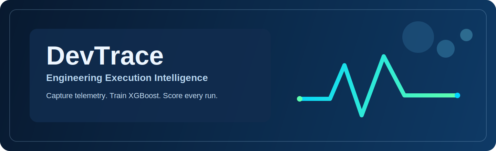
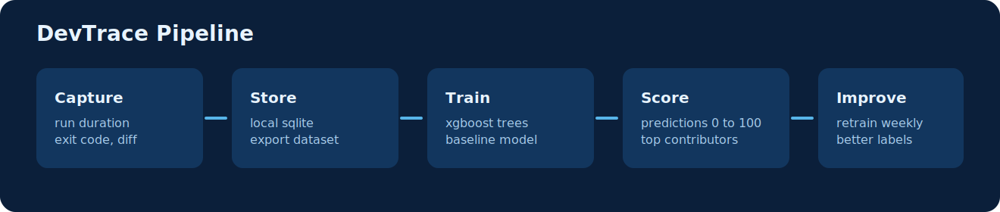

# DevTrace

<p align="center">
  
</p>

<p align="center">
  
</p>

<p align="center">
  <a href="https://github.com/gupta799/dev-trace/actions/workflows/ci.yml"></a>
  
  
  
  
</p>

DevTrace gives engineering organizations a practical way to measure and improve developer and CLI-agent execution quality.

It captures command-level telemetry, builds model-ready datasets, and applies XGBoost scoring to every new event so teams can move from intuition to measurable execution intelligence.

## Why this matters for enterprise teams

- Standardize how productivity and execution risk are measured across teams.
- Build a shared telemetry foundation for developer analytics and agent governance.
- Add explainable model scoring to command workflows without changing developer tools.
- Keep collection local-first and sync centrally when your organization is ready.

## What DevTrace does

- Captures command execution metrics in real repos.
- Stores events locally in SQLite.
- Exports clean datasets for ML pipelines.
- Trains and serves XGBoost model artifacts.
- Auto-scores new command events with top feature contribution signals.

<p align="center">
  
</p>

## Feature status

- Feature 1: data collection implemented.
- Feature 2: XGBoost training/scoring implemented.
- Feature 3: sync/scaling scaffolded and ready for expansion.

## Metrics captured today

- `command_hash`
- `duration_ms`
- `exit_code`
- `timed_out`
- `files_touched_count`
- `lines_added`
- `lines_deleted`
- `predicted_productivity` (when model scoring is active)
- `top_contribution_feature` (when model scoring is active)
- `top_contribution_value` (when model scoring is active)
- `model_ref` (when model scoring is active)

## How metrics are computed

- Diff metrics come from git working tree + staged state at capture time.
- DevTrace uses `git diff --numstat` and `git diff --cached --numstat`.
- Untracked files are not counted until they become tracked.
- No-op snapshots are skipped when files/lines changed are all zero.

## Installation

### Option 1: `uv` (recommended in this repo)

```bash
uv sync --extra dev --extra ml
```

### Option 2: virtualenv + pip

```bash
python -m venv .venv
source .venv/bin/activate
pip install -e .[dev,ml]
```

### Option 3: package users

- `pipx install devtrace`
- `pip install devtrace`

Homebrew formula (tap-ready): `Formula/devtrace.rb`.

## Quickstart

```bash
# 1) initialize local DB
python -m devtrace.cli init --path .devtrace

# 2) capture one command event
python -m devtrace.cli run --agent codex --path .devtrace --repo . -- sh -lc "echo hello"

# 3) inspect events
python -m devtrace.cli events --path .devtrace

# 4) export dataset
python -m devtrace.cli export --path .devtrace --format csv --out ./dataset.csv
```

## CLI commands

Core:

- `devtrace init`
- `devtrace run`
- `devtrace events`
- `devtrace export`

ML:

- `devtrace ml generate`
- `devtrace ml train`
- `devtrace ml score`

Full options:

```bash
python -m devtrace.cli --help
```

## ML lifecycle

### 1. Generate bootstrapping data

```bash
python -m devtrace.cli ml generate --out ./.devtrace/synthetic/train.csv --rows 50000 --seed 42
```

### 2. Train model

```bash
python -m devtrace.cli ml train --dataset ./.devtrace/synthetic/train.csv --out-dir ./.devtrace/model-xgb
```

Artifacts:

- `model.json`
- `metadata.json` (rows, MAE, parameters, features)

### 3. Score a dataset

```bash
python -m devtrace.cli ml score --model-dir ./.devtrace/model-xgb --dataset ./.devtrace/synthetic/train.csv --out ./.devtrace/model-xgb/scores.csv
```

Scoring output includes:

- `predicted_productivity` (0-100)
- `top_contribution_feature`
- `top_contribution_value`

### 4. Improve model over time (baseline -> auto-label -> retrain)

Recommended loop:

1. Train baseline model from synthetic data.
2. Run `devtrace run` in real workflows so new events are auto-scored.
3. Build retraining datasets by using historical telemetry plus label columns:
   - primary: human/approved outcome labels when available
   - fallback: model-generated `predicted_productivity` as pseudo-labels
4. Retrain and ship a new model artifact version.
5. Repeat on a fixed cadence (weekly/monthly).

Practical guidance:

- Synthetic labels are for bootstrapping.
- Auto labels help scale quickly, but quality improves fastest when blended with reviewed labels and real business outcomes.

## Automatic scoring at capture time

- `devtrace run` auto-scores new events if `<--path>/model-xgb/model.json` exists.
- Use `--model-dir` to point to another model location.
- If no model is available, capture still works and prediction fields stay null.

Example:

```bash
python -m devtrace.cli run --path .devtrace --repo . -- sh -lc "echo test"
python -m devtrace.cli events --path .devtrace --limit 5
```

## Enterprise rollout pattern

1. Capture events locally per engineer/agent workspace.
2. Train baseline model using synthetic bootstrap data.
3. Auto-score incoming events to generate operating-time signals.
4. Build retraining sets with approved labels and/or pseudo-labels.
5. Approve model artifacts centrally.
6. Distribute active model to teams.
7. Sync to central analytics for reporting, governance, and continuous retraining.

## Security and governance notes

- Local-first storage by default (`<path>/devtrace.db`).
- Keep `.devtrace/` out of version control.
- Use command hashing to avoid storing raw command text.
- Redaction and policy controls can be layered before central ingestion.

## Repository layout

- `devtrace/`: CLI, storage, runner, git metrics, ML, sync/server modules.
- `tests/`: storage, git metrics, runner, and ML tests.
- `docs/assets/brand/`: logo, banner, and pipeline visuals for branding.
- `docs/release.md`: release and publishing guide.
- `Formula/devtrace.rb`: Homebrew formula for tap installs.

## VS Code debugging

Use `.vscode/launch.json` profiles and set breakpoints in:

- `devtrace/cli.py`
- `devtrace/runner.py`
- `devtrace/git_metrics.py`
- `devtrace/storage.py`
- `devtrace/ml/training.py`
- `devtrace/ml/scoring.py`
- `devtrace/ml/synthetic.py`

## Runtime notes

- macOS users need `libomp` for XGBoost runtime (`brew install libomp`).
- Training expects explicit `productivity_label` values (human labels or pseudo-labels).

## Release docs

For PyPI publishing, CI, and Homebrew flow, see `docs/release.md`.
